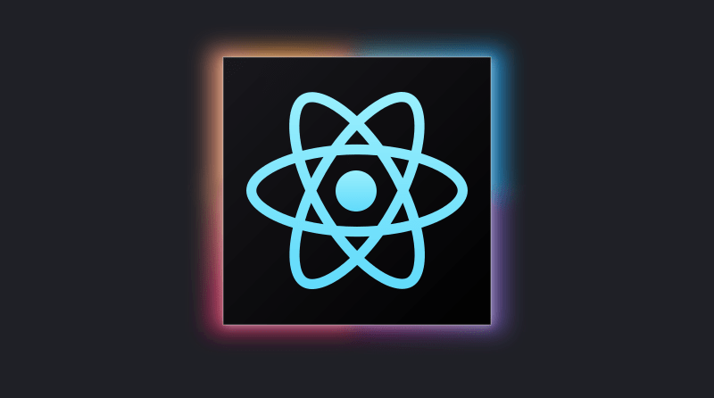

## **What is ReactJS?**
Ever wondered how websites like Facebook and Instagram manage to be so interactive and user-friendly? The secret ingredient is often a JavaScript library called ReactJS, commonly referred to as React.

React is a free and open-source tool that helps developers build user interfaces (UI) for web applications. It's known for its efficiency and flexibility. Essentially, React lets you create complex interfaces through simple building blocks called "components."

Think of React as a set of Lego bricks. Each brick (or component) is a reusable piece that you can put together to create something bigger and more complex. This modular approach makes managing and updating your web app a breeze!

## **Why ReactJS?**
Here's why React has become a go-to choice for web developers:

Component-Based Architecture: Breaks down the UI into manageable, reusable pieces.

* # **Efficient Updates and Rendering: React smartly updates and renders just the components that need to change.**
* # **Rich Ecosystem: Comes with a vast array of additional tools and libraries for routing, state management, etc.**
* # **Strong Community Support: Being widely used, it has a large community and plenty of learning resources.**

## **The Basics of ReactJS**
Before diving in, make sure you're familiar with HTML, CSS, and JavaScript, as React builds on these languages.

### Creating Your First Component
A React component is essentially a JavaScript function that returns HTML elements. Here's a simple example:

```jsx
function Welcome() {
  return <h1>Hello, world!</h1>;
}
```
This function, **Welcome**, is a React component that returns an HTML heading element. Pretty straightforward, right?

### JSX: A Closer Look
JSX is a syntax extension for JavaScript used in React. It looks like HTML but works inside JavaScript files. With JSX, you can write HTML structures in the same file as your JavaScript logic.

```jsx
const element = <h1>Hello, JSX!</h1>;
```
### Props: Passing Data to Components
Props (short for properties) are how you pass data from one component to another. They are read-only and help make components reusable.

```jsx
function Welcome(props) {
  return <h1>Hello, {props.name}!</h1>;
}
```
### State: Handling Dynamic Data
State is what allows components to change output over time in response to user actions, network responses, etc. Think of state as a way to keep track of how a component should behave.

```jsx
class Message extends React.Component {
  constructor(props) {
    super(props);
    this.state = {message: 'Hello!'};
  }

  render() {
    return <h1>{this.state.message}</h1>;
  }
}
```

### Building a Simple React Application
Ready to build a basic React app? You'll need Node.js installed on your computer. Then, you can create a new React application using Create React App, a comfortable environment to learn React.

```jsx
npx create-react-app my-first-react-app
cd my-first-react-app
npm start
```
Alternatively you could use Yarn to create and run your app:

```jsx
yarn create react-app my-first-react-app
cd my-first-react-app
yarn dev
```
This will set up a new React project and start a development server.

### Conclusion
ReactJS is an incredibly powerful tool for building modern web applications. It might seem a bit overwhelming at first, but with practice, you'll appreciate its simplicity and efficiency.

