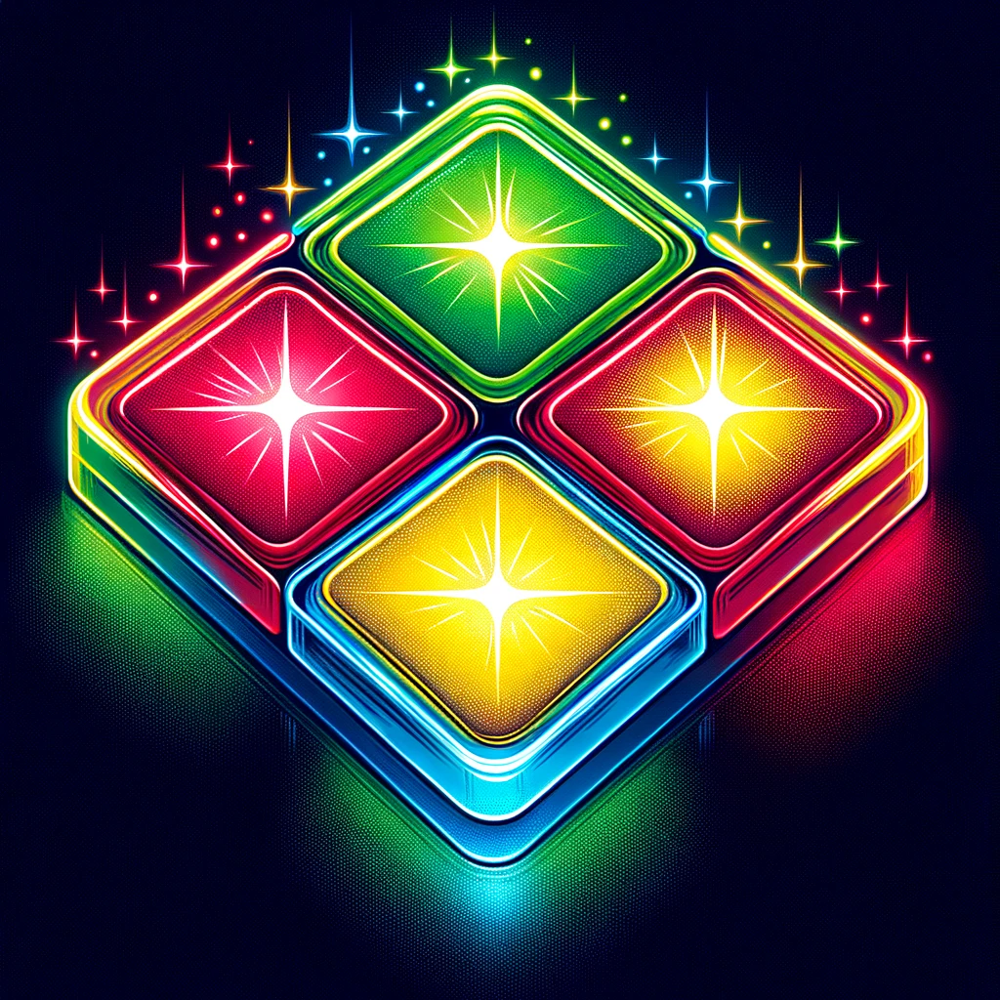

This classic memory game involves following a sequence of lights and sounds and repeating them in the correct order. It's a fantastic way to practice and enhance your JavaScript skills while creating something enjoyable and interactive.

## **What is the Simon Game?**
The Simon Game is a popular electronic game of memory skill introduced in the 1970s. The game has four colored buttons, each producing a specific tone. These buttons light up in a random order, and players must repeat the sequence by pressing the buttons correctly.

## **Overview of the Project**
In this project, you'll create a web-based version of the Simon Game. It will involve:

* Designing a simple user interface with four colored buttons.
* Programming the game logic using JavaScript.
* Managing game states like sequence generation, user input, and victory or failure checks.
* Step-by-Step Guide to Building the Game

### **Step 1: Set Up Your HTML and CSS**
# **Start by creating the basic structure of the game with HTML. Then, use CSS to style the buttons.**

```jsx
<!DOCTYPE html>
<html>
<head>
    <title>Simon Game</title>
    <link rel="stylesheet" type="text/css" href="style.css">
</head>
<body>
    <div id="game">
        <div id="red" class="button"></div>
        <div id="green" class="button"></div>
        <div id="blue" class="button"></div>
        <div id="yellow" class="button"></div>
    </div>
    <script src="script.js"></script>
</body>
</html>
```

# **CSS:**
# **Style your buttons to look like the Simon Game's colored sections.**

```jsx
#game {
  display: grid;
  grid-template-columns: repeat(2, 100px);
  gap: 10px;
  justify-content: center;
  margin-top: 50px;
}

.button {
  width: 100px;
  height: 100px;
  border-radius: 50%;
}

#red { background-color: red; }
#green { background-color: green; }
#blue { background-color: blue; }
#yellow { background-color: yellow; }
```

### **Step 2: Adding JavaScript**
Now, let's get to the exciting part - the JavaScript.

Initialize Game Variables
First, initialize variables to store the game's state.

```jsx
const gameSequence = [];
const playerSequence = [];
let level = 0;
```

# **Game Logic**
# **Implement the core functionality of the game: generating sequences, capturing user input, and checking for wins or errors.**

```jsx
// Function to generate a random sequence
function nextSequence() {
    const colors = ['red', 'green', 'blue', 'yellow'];
    const randomColor = colors[Math.floor(Math.random() * 4)];
    gameSequence.push(randomColor);
    flashColor(randomColor);
    level++;
}

// Function to flash a color
function flashColor(color) {
    // Code to flash a button
}

// Function to handle a player's click
function handlePlayerClick(color) {
    playerSequence.push(color);
    checkSequence(playerSequence.length - 1);
}

// Function to check the player's sequence against the game's sequence
function checkSequence(currentLevel) {
    if (gameSequence[currentLevel] === playerSequence[currentLevel]) {
        if (playerSequence.length === gameSequence.length) {
            setTimeout(() => {
                nextSequence();
            }, 1000);
        }
    } else {
        // Code to handle the wrong sequence
    }
}

// Start the game
nextSequence();
```
# **Event Listeners:**
# **Add event listeners to the buttons to handle user input.**

```jsx
const buttons = document.querySelectorAll('.button');
buttons.forEach(btn => {
    btn.addEventListener('click', () => {
        const color = btn.id;
        handlePlayerClick(color);
    });
});
```


# **Step 3: Polishing the Game**
**Add additional features like sound effects, a score display, and animations to enhance the player's experience.**

Building the Simon Game with JavaScript is a great way to learn and practice various aspects of JavaScript, from handling events and arrays to creating logic for games. As you progress, you'll gain confidence in your coding skills and have a fun game to show off. Remember, the key to mastering programming is consistent practice and challenging yourself with new projects. Enjoy the process and happy coding!